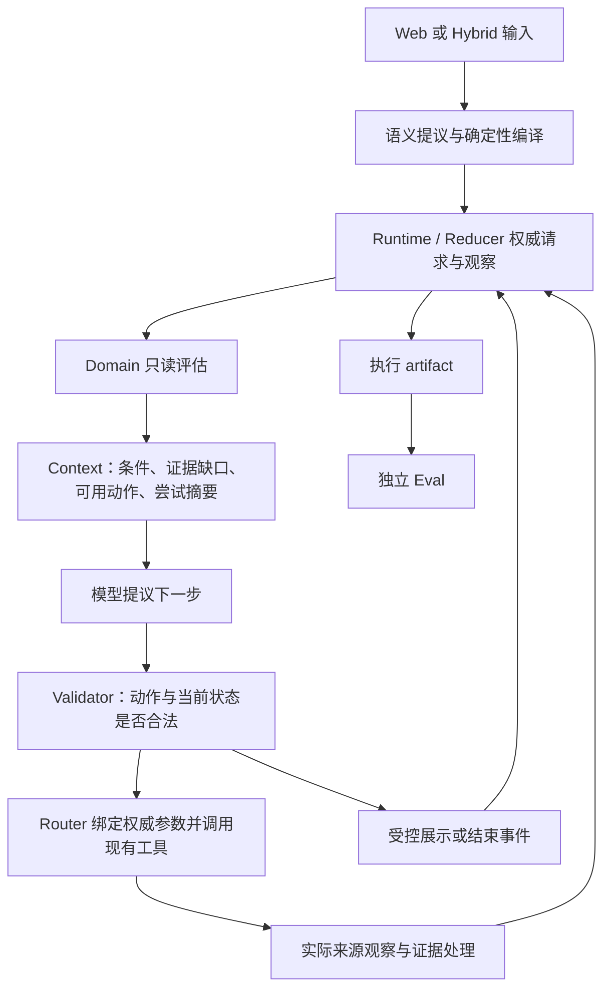

# Restaurant 只读调查执行契约收敛设计

- Status: Accepted / implemented offline slice
- Document revision: 1.1
- Last updated: 2026-09-15
- Source of truth for: 当前只读调查契约、保留边界与验收设计；真实模型/来源结果仍不由本文替代
- Related ADRs: [ADR-0025](decisions/0025-model-directed-read-investigation.md)、[ADR-0026](decisions/0026-concrete-visit-goal-and-reception-semantics.md)、[ADR-0024](decisions/0024-deterministic-time-and-diagnostic-read-completion.md)
- Related documents: [STATUS](STATUS.md)、[Test](skills/test/SKILL.md)、[Eval](skills/eval/SKILL.md)

## 1. 要交付什么

保留当前单 Agent、Semantic Compiler、Runtime/Reducer、Router、Playwright Browser Executor、Web Skills 和 PostgreSQL。收敛 Restaurant 只读链的工具语义、证据接纳、决策反馈和结束方式；不重写整个架构，不建立 Planner、策略图、技能市场或第二套执行器。

目标是：模型可选择不同的合法调查顺序，每个顺序都使用相同的请求、来源和证据契约。模型选错动作时反馈具体问题；合理结束没有结果的调查不必伪装成用户缺信息或系统报错。结果真实性仍由来源证据与确定性边界约束，模型的调查质量单独评价。

不能保证每次模型决策正确，也不以模型选择同一序列作为验收。不能靠降低身份标准、删除 HARD、改变用户时间或给 Golden 定制路径提高通过率。

本设计只做一段可从 Web/Hybrid 真实入口驱动的纵向能力。H001–H005 是当前公开开发诊断输入，不是产品分支；离线组合运行仅替换模型/HTTP/页面边界，Live仍需单独授权。已经消耗的 Live 预算不因本文件自动恢复。

## 2. 已知证据与诊断边界

依据：[08时批次报告](../.eval-artifacts/hybrid-schema-fixed-2026-09-14/1789373476/REPORT.md)、[09时 Terra 修改审查](../.eval-artifacts/hybrid-schema-fixed-2026-09-14/1789373476/terra-followup-review.md)。两者为本地忽略目录中的 exposed development diagnostic，不能称 Clean Baseline。

| 已观察问题 | 本设计处理 |
|---|---|
| 旧 H001 的新 TableCheck 事实被旧事实集合过滤；当前代码已可接纳原 artifact | 保留有效修复，把证据适用规则集中为一个实现，增加独立来源先后顺序回归 |
| 新 H001 明明有可查候选，模型却认为预约读取无法补 omakase | 工具明确可返回的补充事实；Context 给具体缺口与实际尝试结果，不按案例强制调用 |
| 新增 AVAILABILITY 全面禁止独立事实调查 | 删除；空位与负向类型等事实可以由不同合法工具共同完成 |
| H002/H003 换候选后仍缺同一种主观 HARD 证据 | 区分事实生产能力与调查质量；不能把更大候选池当作必然进展，不能自动降级 HARD |
| 地点名称/地址子串导致无关商户可冒充地标 | 删除地址命中即确认实体；按实际地点实体及来源上下文判断 |
| STOP 多靠 STEP_LIMIT/REJECTION_LIMIT，Eval 再解释成无结果 | 新增受控的只读无结果结束提议，分开执行事实、结论依据、调查质量 |
| 长达十分钟只看到启动信息 | 复用现有轨迹链增量输出阶段事件，不再等最终 artifact 才知道当前工作 |

本轮不承诺解决所有来源覆盖、跨平台预约、主观适用性判断。它们必须在正常调查中可识别、可反馈、可如实收尾，不能悄悄变成满足条件。

## 3. 职责与验证放在哪里

| 位置 | 保留的验证 | 不再承担 |
|---|---|---|
| Interpreter/Compiler | 用户条件保真、时间语义可物化、冲突与字段来源 | 制定调查路线、输出下一动作 |
| 动作前 Validator | 已知候选、必要参数、来源/引用合法、预算/取消、有效重查触发、当前可执行状态 | 按目标禁止某类合法补证、替模型挑下一工具 |
| 来源读取与 Grounding | 实体关联、真实内容、控件生效回读、来源归属、当前请求 | 自动扩大或放松用户需求、决定整个任务成功 |
| 结论前 Domain 评估 | 区域、适用时段、HARD、证据支持链/时效/冲突、所需 slot | 要求来源恰好使用用户的同一句自然语言、规定证据取得顺序 |
| Policy / booking Verifier | 写操作授权、幂等、现实预约 Outcome | 本次无任何放宽 |

同一条规则只有一个生产实现。每步重验当前状态、展示前重验新鲜度是必要的调用时机，不等于维护两份相同规则。

## 4. 最小的 Domain 只读评估

把 `action-validator.ts` 中现有 presentation/evidence 派生逻辑移到一个 Domain 纯函数模块（建议 `read-assessment.ts`）。Context、Validator、Router 共用；不新增服务、数据库、框架或配置 DSL。这不是新的决策 Kernel：它不选动作、不排序下一步、不调用模型或网络、不写 State。

输出保留当前展示资格，同时给出所有相关缺口，替换单一 `missingReason` 字符串；无需建立通用条件 ontology：

- 请求：权威请求版本、已解析时间/位置、必要字段及未解决表达。
- 候选：已证实事实摘要与引用；每个适用区域/营业时段/开放 criterion/slot 的 `SUPPORTED / CONFLICT / UNKNOWN`。
- 调查：实际做过的事实/预约读取、来源类别、观察时间、稳定失败原因、仍未解决的条件；失败尝试也有引用，不依赖成功证据存在。
- 操作可用性：某动作当前能否执行与确定性原因。资格只取决于动作所需输入、资源、已执行范围与安全状态，不取决于推荐/空位标签本身。

开放 criterion 仍使用已有文本、polarity、strength；关联使用当前请求内稳定引用，不新建“菜系/氛围/目的”分类系统。源事实、派生判断、未知和冲突不可混成一条自然语言结论。

Context 只带有界的已验证事实摘要、来源类别、观察/证据引用和失败摘要。原始网页、Cookie、任意 URL、选择器、授权数据仍不进入业务 Agent。详细页面交给现有 Browser Executor；完整审计留在 artifact。这是对当前过窄 Context 边界的显式修订，见 ADR 草案。

数据来自权威 State 和当前 run 的真实轨迹；重建/加载时按现有 runtime 接口获取，不允许从模型 summary 反推观察。可以复用已有 checks、evidence 和 trajectory 字段；缺少作用域时最小扩充当前记录，不建立第三本独立证据账。

## 5. 保留三个调查动作，修正其能力契约

| 动作 | 前提与真实能力 | 合法结果 |
|---|---|---|
| `SEARCH_RESTAURANTS` | 已知地点语义和目标；可以改变检索提示，不能改权威条件 | 候选、地点依据以及实际返回的基础事实；搜索本身不保证匹配全部条件 |
| `INVESTIGATE_CANDIDATE_FACTS` | 已知候选；按实际来源需求检查参数，不因 AVAILABILITY 禁止 | 现有 Google/公开网站链可读取的类型、营业事实及允许的带引用类型判断；不会保证所有开放条件都能证明 |
| `CHECK_AVAILABILITY` | 已知候选与完整日期、时段、人数 | 同店身份、条件回读、slot 状态，以及在本次页面实际取得的补充餐厅事实；不能保证必然取得这些内容 |

`CHECK_AVAILABILITY` 不是 slot-only，`INVESTIGATE_CANDIDATE_FACTS` 也不是 recommendation-only。工具说明与真实返回必须一致。只保留一处静态能力描述，Prompt 不再另写一套缩窄含义。

Context 不指定“遇到 omakase 去 TableCheck”。它应能表达：某 criterion 未证实；事实读取未补足；预约读取仍可用且可能返回补充餐厅事实。是否尝试由模型决定。没有预约参数时不能为读事实编造人数；当前工具不支持的页面读取如实标能力缺口，不声称已具备任意网站访问。

推荐可能先查事实，也可能在参数齐全时先查空位；空位目标可能先补排除条件，再查 slot。删除目标与动作的互斥规则，保留同一次已执行范围的重复请求限制。新请求、用户刷新或实际新来源线索是否构成新读取，要以结构化作用域确认，不能接受自由填写的“重试理由”解锁。

本切片不拆/重写两个预约 Adapter 的全部浏览器流程。确定性解析可作为快捷方法，Web Skill 描述站点使用方法，受控浏览器负责实际观察与操作。门店发现失败必须反馈“错分店/没有解析结果/冲突/资料不足”，不能统一要求模型再搜更多餐厅。

## 6. 当前证据的接纳与失效

证据可信度来自候选/来源关联、实际观察、请求适用性和时效，不来自动作名称或调用顺序。

1. 保留原始不可变 `readEvidence`、已有 `supersedesEvidenceIds` 和请求版本机制。将当前 fact/availability observation 的有效证据统一评估；不能以单次 factCheck 的引用集合屏蔽后来其他合法读取提供的事实。
2. 补齐必要的候选、来源、观察用途/事实作用域与请求关联。一个新 slot 观察不自动抹掉独立菜系事实；新的同作用域观察会使旧结果退出当前证明集合，即便这次 UNKNOWN 没产生正向 evidence。
3. 用户显式刷新会使其目标集合对应的旧证明暂时不能用于重新展示；整个刷新集合收尾后，仍按已有语义处理失败、无位和未知。不能恢复旧成功冒充新检查成功。
4. Google 的新事实不能仅因“更晚”替代另一来源的不同事实。适用事实间有明确冲突，返回 CONFLICT；不能挑选有利证据。新关闭或当前明确无 slot 不能被旧营业证据覆盖。
5. `MODEL_JUDGMENT` 必须保留来源支持链；引用存在不证明语义成立。当前仅有的类型判断能力不能冒充“适合约会”等主观评价能力。

实现先复用已有检查记录和替代关系；不得增加跨 Domain 的通用证据图。两种独立读取顺序应等价；同作用域刷新、冲突、过期等有时间方向的观察不要求交换顺序后结果相同。

## 7. 正常结束调查，而非依赖报错

新增一个窄的只读动作提议：`END_READ`。模型不传成功标志、候选事实或任意最终 Outcome；可附现有短 decisionSummary，仅用于解释选择。Router/Domain 从真实记录生成结束依据。

允许结束的最低条件：请求信息足以开展本次调查；存在当前请求的实际调查记录；没有进行中的读取/刷新/预约操作；没有已知合格但被忽略的可展示结果；不能借此掩盖语义、Router、认证或其他已记录的内部执行失败。

结果为新增的 Domain 终态/Outcome `NO_VERIFIED_RESULT`：只表示“在本次已调查范围和条件下，没有可展示的可靠结果”。由 Runtime 接受事件后写入，包含当前请求、调查范围、剩余缺口、来源限制及停止依据。不得宣称全区域无位或所有可能查询均已穷尽。

不要求先穷尽所有合法搜索才允许结束；模型可以提出有界停止。是否过早停止属于独立调查质量评估：仍有明显未尝试的有效路径时，Eval 可判质量不满足或需人工审查，而不能仅因出现正常终态自动通过。机器能证明的是记录和结论边界，不能从有一次来源调用推导模型已尽力。

此终态在通用 Runtime 使用既有正常终止 lifecycle（可用 `SUCCEEDED` 表示只读工作已收尾），业务 Outcome 必须仍是 `NO_VERIFIED_RESULT`。Web、CLI、指标、Eval 均不能把 lifecycle 的成功转成“找到餐厅”。不增加 Core 的餐厅专属状态。

用户取消仍是取消，时间/步骤上限仍是预算停止，模型/执行失败仍是失败。不能自动把它们变成 `END_READ`。用户补充需求可从正常无结果终态通过既有语义事件启动新的 request revision；不自动重跑。

有结果继续使用 `PRESENT_RESULTS`；真正缺用户信息继续 `ASK_USER`。已知源码语义缺陷不靠给用户补问掩盖。Booking 的授权与 Verifier-only Outcome 完全不变。

## 8. 进展、停止与日志是一条观察链

用结构化 Observation 增加少量字段，替换解析英文 `"newly accepted"` 后缀：实际新增候选、相关新事实、解决/冲突/仍未知的缺口、实际执行的读取范围。这些字段由执行结果和状态差异计算，不能来自模型自述。

不把新增候选数、产生新时间戳或执行任意一次工具等同“任务有进展”。也不因为一两次没有满足 HARD 就机械判停止：明确冲突、一次有效 UNKNOWN 或排除错误来源也可能有调查价值。

保留硬预算/取消；保留无任何外部执行或新观察之间重复提出同一非法动作的保护。针对重复读取用请求+候选+动作实际范围和观察历史判断；不能仅因为两次 rejection code 相同就声称所有路线耗尽。模型在反馈后可选其他合法调查或 `END_READ`，没有合法恢复时由外层如实终止。

现有 trajectory 增量持久化，增加同链的 `ACTION_STARTED / ACTION_FINISHED / EVIDENCE_ASSESSED / RUN_ENDED` 阶段记录（名称为设计建议）。启动时写独占 run manifest；读取前输出开始与累计预算；来源返回后输出结果/耗时/缺口变化。长 Browser 调查沿已有事件回调记录候选和阶段，明确区别“进程存活”和“取得新进展”。

Hybrid 写 run 内 JSONL 并给 CLI 简短进度；Web 复用已有 Activity/SSE 与 artifact 导出。共享事件结构和 redaction，不双写两套权威 State，不引入消息队列。日志输出失败不得篡改来源结果，必须在 final diagnostics 明示缺记录。结果 artifact 先保存，评价后补；日志不含凭据、无关个人信息、隐藏思维链或整页重复正文。

## 9. 时间、地点与条件保真作为前置正确性

沿用代码持有参考时刻和 Asia/Tokyo，下午12:00–17:00。日期与时段组合须保持原表达的关系；明确星期与“从现在起”的完整时间点冲突时不能只选一个字段掩盖冲突。`after work` 无法物化时保留未解决表达，不转成不影响调查的普通 SOFT 条件；原文真正未确定具体时段可请求澄清，内部漏字段单独归因。

不把所有 recommendation 强制设日期；区分用户没约定时间与已经约定但未解析完整。后者不能跳过营业时间检查而展示。已过去的访问窗口也不能冒充未来可去；不自动改成明天。Live 验收应记录这一情况，不能为测试通过静默改原输入。

地点解析保留来源 place ID/坐标/名称/地址/类型和候选观察，结合已有城市上下文。地址包含地名仅支持“位于这里”，不支持“它就是这个地标”。别名/语言/站点后缀等需要来源对应，不能用任意子串匹配或固定别名表替代。当前解析结果在请求语义不变时可复用，避免每次重搜餐厅都重复解析同一地标；用户改变地点即失效。

本切片不建立主观质量体系。SOFT 的等义改写可以人工语义审查，不以字符串不同直接当硬冲突。真实 HARD 仍须支持；若 Interpreter 无依据升级为 HARD，应按语义错误修复；若用户确实要求当前不能证明的 HARD，系统应如实表达能力缺口，不能无限扩候选或强行降级。公开 Gold 与产品口径冲突单独版本化审查，原历史数据不覆盖。

## 10. Eval 评价结果，不复制执行器的结论

生产链共享只读评估函数；Evaluator 不调用该函数后把返回值当作独立验证。可复用时间/电话等基础纯函数，但预期来自原请求、可信 referenceTime 和独立来源样本；保留故障注入能打破自证。

分开记录三个维度：

| 维度 | 内容 |
|---|---|
| 执行事实 | 实际 phase/action、来源尝试、取消、上限、失败；不含未经核验的 QUALIFIED 标签 |
| 结论支持性 | 展示引用是否支持请求；无结果是否仅限实际调查范围；缺信息是否真实缺失 |
| 调查质量 | 是否走错目标、忽略可用证据、重复无效搜索/拒绝、过早停止；可自动验证与人工审查分别记录 |

只有独立验证完成才能给 `QUALIFIED_RESULT`。正常无结果也不能只凭终态通过。未知记录为 NOT_EVALUATED；具体冲突为 NOT_SATISFIED；来源 UNKNOWN 不变成全局否定。

Live 的 now/相对日期独立物化到该 run 的可信参考时刻；离线使用冻结时钟。不能从 final intent 复制 expected 值，不能将旧16:00与新的东京“现在”比较。新增终态、Context、trajectory/evaluator版本在实施时分别更新，原 artifact 只追加新 sidecar。

## 11. 删除、合并、保留和新增清单

| 现有位置 | 处理 |
|---|---|
| `action-validator.ts` | 删除 FACTS_NOT_APPLICABLE 目标禁令；搬出证据评估纯函数；保留输入/状态/安全/重查与结论校验 |
| `agent-context.ts` | 删除 recommendation-only 的事实调查暴露；从同一评估生成动作可用性、全部缺口和有界尝试摘要 |
| `restaurant-capabilities.ts`、`agent-decision.ts` | 合并重复/矛盾工具说明；删除路线命令与错误的slot-only能力描述；补正常无结果结束提议 |
| `restaurant-agent-loop.ts`、Router | 删除英文日志解析和“做过任意读取就算进展”的捷径；结构化观察、受控结束、增量日志；不增加固定阶段调度 |
| `task-definition.ts`、contracts、Web/Runner结果处理 | 新增窄只读终态与记录，复用事件/Reducer/持久化；同时更新真实调用者 |
| Google named-place resolver | 删除任意名称/地址子串作为实体确认；保留真实坐标、歧义/失败观察与预算 |
| 证据生产/现有两个预约 Adapter | 保留提取、身份、条件回读；统一结果说明和引用，不整套重写，不默认加 Provider |
| diagnostic evaluator/materializer | 删除 phase→QUALIFIED、limit→正常无结果捷径；修独立时间与调查行为核验 |
| 测试 | 退役断言上述坏限制的测试，扩展既有真实组合；历史运行资料保留 |
| Policy、Booking Verifier、Core Runtime、数据库基础设施 | 不做重构；仅 Domain 新结果所需的调用者/序列化更新 |

预计是多个现有文件的局部修改，新增至多一个 Domain 评估纯函数模块和必要的终态/观察字段。净行数不作承诺或验收指标；必须减少独立业务规则和重复决策点。若实施开始要求新通用策略层、证据图或大批兼容代码，先回到本切片范围检查。

## 12. 实施顺序和退出条件

### A. 共享契约与两种合法顺序

先把新禁令移除，统一工具说明/Context/证据评估，保留当前已经修好的新事实接纳。新增的观察作用域与现有调用者在同一切片接通。验证事实→slot、slot→补负向事实都能满足相同请求；不能脚本化指定“某case必须调用某站点”。这一步能通过现有真实组合入口，不需要新框架。

### B. 无结果结束、进展与诊断

把 `END_READ → Router → Event → Reducer → Outcome → Web/Hybrid artifact → Eval` 一次接通；同步结构化进展和增量日志。验证无结果范围、提前停止评价、真正缺用户信息、内部失败、取消各自独立。不能连续建设几个没有入口的基础设施阶段。

### C. 前置正确性与冻结验收版本

完成时间/地点已证实反例和工具真实来源观察缺口。Subjective HARD 无可用证据的情况应正确收尾并标能力限制，不能伪称主观适用性支持已实现。检查所有入口和评分口径，运行 Test Skill 所需门禁，冻结代码/Prompt/Skill/Evaluator哈希再开始Live。批次期间修改源码必须结束该版本批次，后续运行记为不同修订，不把跨修订五例合成最终验收。

| 关键回归 | 从哪里开始到哪里结束；要捕获什么 |
|---|---|
| 独立读取顺序 | 实际 composition 初始化→来源样本→State→展示→独立Eval；旧的事实集合屏蔽、空位禁事实 |
| 更新与冲突 | 同入口→旧正向→同作用域刷新UNKNOWN/关闭/无位→展示拒绝；不同来源独立补事实仍保留 |
| 调查后无结果 | 同入口→真实来源替身未知/能力受限→END_READ→持久Outcome→artifact评价；不能等价于全局满座 |
| 有效结果却忽略 | 已有可展示证据却重复调查/请求无结果结束；结果支持性和调查质量分别发现问题 |
| 反复无效搜索 | 搜索与事实读取交替、查询改变但缺口与来源范围不变；不是只测相邻两次相同JSON |
| 请求完整性 | 复合日期/时段、日界、地点变体、无关商户地址、同品牌错分店→实际来源参数与最终依据 |
| Web生命周期 | 真实HTTP/SSE/PGlite入口→进度→结束→重载；取消/旧请求晚到不会覆盖新请求 |
| 两run隔离 | 实际组合并行，独立预算/会话/取消/日志，不能一个run的来源耗尽或结束污染另一个 |

离线只替换外部模型传输、HTTP或浏览器来源，保留生产内部链。模拟来源明确标Synthetic；使用完整合法真实样本才称Replay。不把中途手工填State的Unit称E2E。

补一个有界的“真实模型决策+固定来源响应”诊断阶段（混合模式单独标记，仍需模型预算授权）：对前述不同路径的Context/工具描述验证实际模型能理解可用能力和失败反馈。它不是新执行器，复用当前 composition 与现有依赖注入；不访问真实预约网站。这样区分内部接线、模型选路与实时来源问题，不再只能靠十分钟Live区分。

之后才是H001一次Live探针，再H002–H005最多两个独立run并行；最终普通Web Live按新授权范围安排。相对时间案例在窗口已过去时应报告时间适用限制，不改原输入洗绿。当前文件是设计，不授权付费调用或复用已耗尽预算；实施前在计划中明确实际新批次范围，沿用共享调试上限，不提升产品默认值。

实施退出标准：不同合法调查顺序能完成；本次已知确定性断点由真实组合反例捕获；内部失败不伪装无结果；实时未知不伪装无位；途中能看到阶段和资源；最终固定版本的Live结果如实区分通过、能力限制、未评估。核心共享链仍有已知系统错误时不建议直接再跑整批。

## 13. 测试与Eval的具体改造清单

验证矩阵仍唯一维护于[Test Skill](skills/test/SKILL.md)，本节是这次设计的具体落点，不另建一份通用门禁。本轮必须调整测试，不是保留原断言后只追加若干成功用例。以下均是待实施工作，当前没有据此修改测试代码或运行新的测试。

### 13.1 模块测试：验证契约，不固定调查路线

| 主要现有位置（相对src） | 本轮改造 | 能捕获的独立失败 |
|---|---|---|
| `domains/restaurant/action-validator.test.ts`、`agent-context.test.ts` | 删除“AVAILABILITY必须拒绝事实调查”的断言；用同一个请求验证事实/slot动作资格与Context一致。资格评估的完整规则只在所属测试主覆盖 | 模型看到的动作可用、Validator却拒绝；目标误锁补证 |
| 拟提取的`domains/restaurant/read-assessment.test.ts` | 从旧Validator测试迁移证据适用规则，避免两处复制。覆盖独立来源顺序、同作用域更新、未知/冲突、引用不属于当前候选/请求 | 新事实被旧集合屏蔽；旧正向压过新失败；派生判断借错来源 |
| `domains/restaurant/semantic-compiler.test.ts`及Proposal/Interpreter测试 | 独立预期覆盖日期+时段组合、跨日、未解决表达、用户未约定时间与表达被漏掉的区别 | 周五被相对时刻覆盖、漏日期绕过访问时段要求；不得将错误时段移为SOFT来通过 |
| `domains/restaurant/agent-action.test.ts`、`agent-decision.test.ts` | END_READ的strict传输与本地解析、伪造字段拒绝；工具能力描述只断言必要语义契约，不绑定完整提示文本 | 新动作无法通过真实wire Schema；模型可提交任意Outcome或自由证据 |
| `infrastructure/deepseek/deepseek-model-gateway.test.ts` | 保留并扩展实际发出的Schema检查，覆盖本轮新的Context对应动作/Proposal；不仅mock一个合法响应 | 再次出现离线解析正常但真实请求HTTP400 |
| `integrations/google/google-places-restaurant-search.test.ts` | 删除把名称/地址任意包含视为地标的旧预期；增加合法名称变体、错类型商户、真实歧义及不完整返回 | 区域内商户冒充地标；修松匹配后错误通过 |
| 既有TableCheck/Tabelog、website facts、source resolver测试 | 优先用已脱敏样本补充错分店、提取为空、资料冲突、已确认同店但外部平台不可达的分类；区分页面就绪、动作尝试和条件生效 | 一个总UNKNOWN掩盖不同失败；slot读取中的补充事实没有进入返回值 |
| 既有Router、Harness与持久化测试 | 更新新Outcome、请求范围、取消和日志关联，不复制所有纯规则排列 | 终态无法存储/恢复、取消后晚到结果覆盖、日志串run |

新增测试必须先能复现对应旧故障或错误契约；可通过受控反例/内存副本证明，不要求为了红灯临时回滚整个共享工作区。纯函数允许构造State，报告必须标为模块验证。不要在每层复制相同完整输入与断言。

### 13.2 集成测试：保留两条实际入口

主覆盖复用 `src/eval/restaurant/agent-loop/hybrid-read-composition.test.ts`，Web覆盖复用 `src/server/local-web-server.test.ts`；应用终止/授权保护复用现有Harness。不得增加另一个“看起来像真实入口”的测试执行器。

Hybrid从解释用户消息、编译与Runtime初始化开始，Web从真实HTTP输入开始。只替换外部模型传输、Google HTTP及来源页面，保留Compiler、Context、Validator、Router、Grounding、Reducer、持久化适用路径和最终artifact。浏览器控件另由现有本地Chromium Fixture验证；不能把Browser Runtime完全替换后声称控件操作被测。

第12节八类关键回归落实到这些现有文件。两种不同但合法的动作顺序各经过完整来源生产与接纳，比较同一用户承诺是否满足，不比较随机ID/时间戳，也不要求有更新冲突的观察交换顺序后相同。恶意/错误来源样本的预期独立于执行结果，不从intent自动制造“满足全部条件”的证据。

每项主覆盖标注：输入入口、终点、替换的外部边界、独立预期、能捕获的故障、不证明范围。缺口至少包括：slot+负向条件通过独立事实工具闭环；源事实先后顺序；正常无结果持久化及独立评价；有合格证据却错误结束；搜索/事实交替空转；真正缺输入与内部失败；Web中途进度、取消、重载；双run隔离。

### 13.3 真实模型加固定来源：验证选路质量

这是拟新增的混合诊断模式，不进入默认`npm test`，不称纯Mock、纯Replay或完整Live。不新增执行框架；只在当前composition的外部依赖注入处使用固定来源响应，模型仍经真实Gateway，明确记录实际模型调用和费用。

输入为独立的公开开发行为场景，而非要求模型按H001–H005的已知答案行动。包括：缺事实但另一合法读取可补；先得到slot仍需补排除事实；某来源失败后合理换路或结束；确有能力限制时诚实收尾。

不规定唯一动作序列，不要求调用特定网站，也不以是否使用最多工具评分。检查条件保真、实际使用的工具能否解决缺口、观察是否被正确利用、是否重复无效动作、结束结论是否受证据支持。固定来源环境须支持这些已声明的合法动作；模型选择了尚未录制但合法的调用时标 `DIAGNOSTIC_SOURCE_COVERAGE_MISSING`，不能伪造成真实来源失败或直接给模型判错。

模型仍可能偶发错误，少量通过不代表可靠性保证。把失败动作/Context与来源覆盖分别留档；不为测得稳定而自动重试到通过。场景数、每run步数和真实模型总调用上限在实施计划中单独列明，获准后才运行；当前设计未消耗或授权该预算。

### 13.4 Eval实现与rubric一起调整

主要位置：`diagnostic-evaluator.ts/.test.ts`、`live-case-materializer.ts/.test.ts`，以及Web/Hybrid artifact生产者。保留原artifact、原始输入/Gold与旧sidecar；新增版本及新补评，不覆盖历史。

独立核验至少包括：

1. **条件保真**：原请求与可信参考时刻独立产生期望；缺失、冲突、主观等义待审分别记录，不从最终State复制Gold。
2. **结果支持**：逐个展示候选验证真实引用、同店/来源、时段/人数、HARD、更新/时效；生产端`eligible/verified/phase`不能成为通过依据。
3. **调查与收尾**：重复搜索/拒绝、忽略已有可用证据、范围内无结果与全局无位、提前停止、缺输入与内部失败分别评价。不能证明模型已尽力时标未评估，不将有一次工具调用等价于调查充分。
4. **资源与过程完整性**：预算按run累计、并行隔离、记录缺失/强杀、中途日志与最终轨迹关联；进程存活不是业务进展。

对真实组合产生的artifact做独立副本变异：改日期/人数/门店、删除引用/支持链、把UNKNOWN标无位、恢复已失效事实、将内部失败改标正常无结果、添加重复无效搜索。对应维度必须拒绝或明确未评估；不得只是Evaluator和执行器同时调用同一判定函数获得相同结果。

评分器自身测试通过、产品集成通过、真实模型选路通过、来源Live通过是四个独立结论。软偏好等义不因字符串不同直接失败，也不由新增LLM Judge自动洗绿；按当前Eval规则列人工审查。修改Gold或产品承诺须人工review；实现既有规则无需为每个bug重新审批。

### 13.5 测试资产维护与交付

工程切片与测试/rubric同一个diff交付，不允许“工程先走，之后再补Eval”。在切片说明中列本次契约→唯一主覆盖→真实入口集成→artifact维度→剩余Live不确定性即可，不新建覆盖平台或重复大清单。

保留当前有效安全回归；删除被替代执行路径及其细节测试；迁移后更新所有调用方，不创建旧新版本并行测试链。最终报告列新增/迁移/删除的覆盖去向、对应模式与实际结果，不以总数增长说明质量提升。

现有可用命令仍为 `npm test`、`npm run typecheck`、`npm run arch:check`、`npm run build`、`npm run test:browser:fixture`、`npm run eval:restaurant:agent-loop:artifact -- <artifact>`；根据Test Skill选择。真实模型+固定来源模式尚无入口，实施时在既有composition/runner上接入并按仓库命名，不在设计中虚构可执行命令。

## 14. 文档、版本与移交

ADR-0025当前是Draft。它显式提议调整ADR-0012的Context范围、ADR-0014的只读终态以及ADR-0022的候选级当前事实/精确地点名称规则；原Accepted正文不静默改写。方案接受后实施时更新对应状态与引用。

新Domain终态/观察字段涉及持久State时更新schema/version，并修改所有实际调用方与Fixture；如确需数据库DDL追加migration，不改历史migration。现有本地调试Case先保留需审计资料，不在启动时隐式删除或转换，也不引入无真实消费者的兼容层。

实施阶段同步Domain、Orchestration、Capability Matrix、Harness/Eval、STATUS、DEVLOG、TEST-LOG，按实际职责更新；不为每个修改机械新增文档。当前设计阶段不改业务代码、运行Live、提交或推送。
