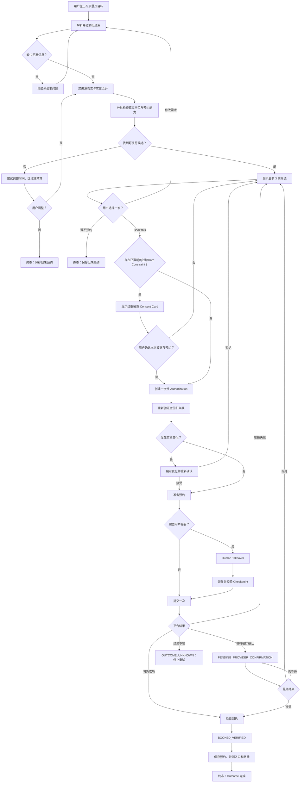
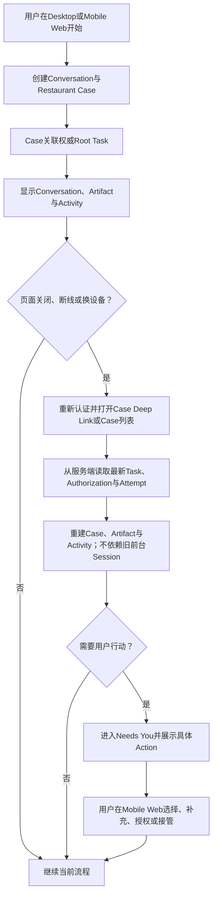
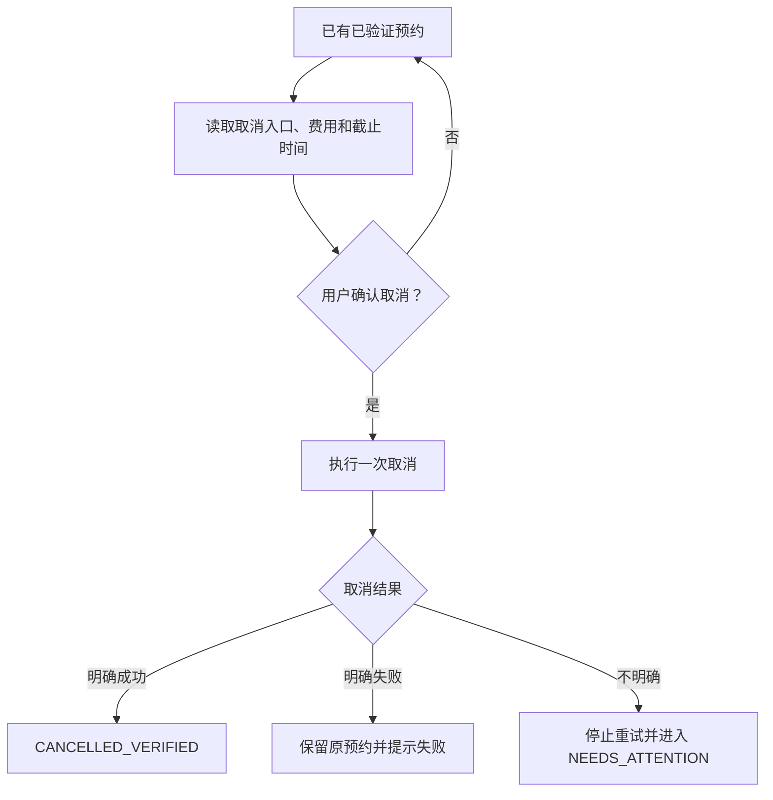
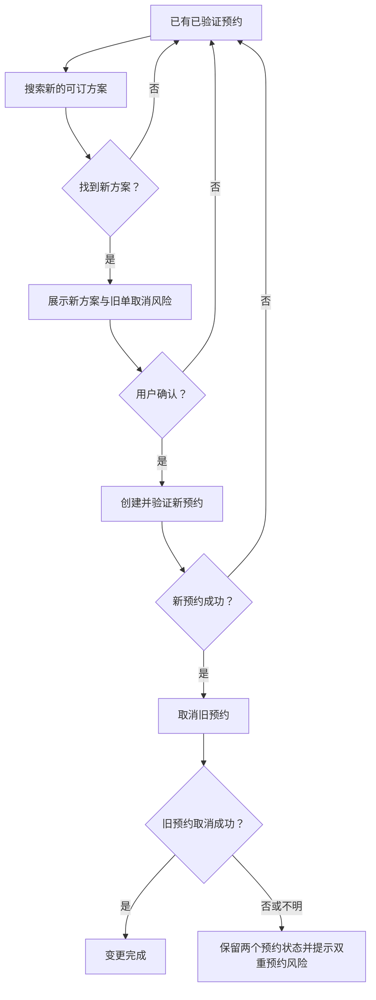

# MVP User Flows

- Status: Accepted
- Version: 0.3
- Last updated: 2026-08-10
- Source of truth for: 用户可见流程、确认点和终态
- Related ADRs: [ADR-0004](../decisions/0004-single-candidate-authorization.md), [ADR-0006](../decisions/0006-web-first-agent-workspace.md)
- Related documents: [MVP PRD](MVP-PRD.md), [Restaurant Domain](../domains/RESTAURANT-BOOKING.md)

## 搜索与预约

## 跨会话与Mobile Web恢复

恢复页面不得只重放聊天文本来推断当前状态。陈旧Case版本、已使用Authorization或已结束Attempt必须显示服务端最新结果，不能再次提交。

## 取消

## 修改

## 用户确认点

1. 候选卡 `Book this`：选择并授权一家；若已声明过敏Hard Constraint，先进入过敏披露Consent Card。
2. 过敏披露Consent Card：确认对外发送的最小过敏信息，可补充说明；未确认不得提交该候选的预约或请求。
3. 条款实质变化：重新授权。
4. 登录、验证码、银行卡、3DS、CAPTCHA：用户接管，不扩大授权。
5. 取消：单独确认取消费用和影响。
6. 修改：确认新预约与旧单取消风险。
7. 跨设备恢复：重新认证只恢复访问权，不自动批准Pending Action。
